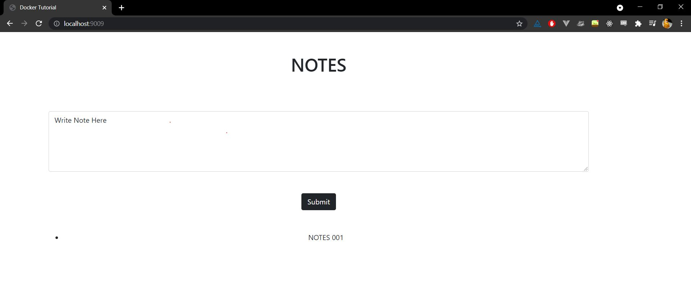

# Docker Tutorial

## To run locally

- Clone the repository
  ```
  git clone https://github.com/ish-u/docker-tutorial.git
  cd docker-tutorial
  ```
- Build the Docker Image of the Node.JS app
  ```
  docker build -t my-notes-app:1.0 .
  ```
- Run the `mongo.yml` file using `docker-compose` to run all the containers
  ```
  docker-compose -f mongo.yml up -d
  ```
- To access:

  - my-notes-app : `localhost:9009`
  - mongo-express : `localhost:8080`
  - mongodb : `localhost:27017`

- Demo
  
